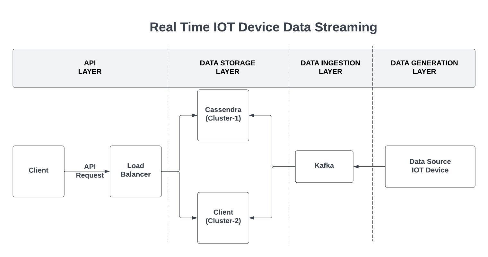

# DDS-512- Real time IOT Data Streaming

This project showcases the integration of Apache Cassandra, Apache Kafka, and Flask to build a scalable and real-time IoT data streaming solution. The system is designed to process, store, and analyze data generated by Apple devices, such as the Apple Watch. With a robust architecture and advanced data handling techniques, it efficiently manages high-throughput data streams while ensuring scalability and fault tolerance.


---
## System-Diagram


### System Components

1. **Data Source (IoT Device)**  
   The Apple Watch acts as the data source, generating real-time sensor and activity data.

2. **Kafka**  
   Serves as the message broker for high-throughput, low-latency data streaming.

3. **Load Balancer**  
   Ensures scalability and distributes API requests from clients.

4. **Cassandra**  
   A highly scalable NoSQL database used for efficient storage and retrieval of IoT data.

5. **Clients**  
   Applications consuming real-time data from the Cassandra database for analytics and visualization.

---

## Key Features

### 1. **Real-Time Data Streaming**
- Continuously captures and processes data streams from IoT devices (e.g., Apple Watch).
- Uses **Apache Kafka** for high-throughput, low-latency message handling.

### 2. **Efficient Data Storage**
- Leverages **Apache Cassandra**, a distributed NoSQL database, for storing time-series data.
- Ensures fast and reliable data retrieval, optimized for IoT use cases.

### 3. **RESTful API Integration**
- Exposes data via a Flask-based **REST API**, allowing developers and applications to access and analyze the stored IoT data.
- Enables seamless interaction with the data pipeline for real-time and historical queries.

### 4. **Scalable Architecture**
- Incorporates a **Load Balancer** to distribute client requests across multiple API instances.
- Designed to handle increasing data volumes and device connections without compromising performance.

### 5. **Data Categorization**
- Supports the collection of diverse data types, including:
  - **Device Metadata** (e.g., device model, battery level).
  - **Health Metrics** (e.g., heart rate, stress levels).
  - **Activity Tracking** (e.g., steps, distance, calories burned).
  - **Environmental Data** (e.g., temperature, humidity, location).
  - **Notifications** (e.g., reminders, alerts, messages).
  - **Device Status Logs** (e.g., operational status, errors, battery health).

### 6. **Fault-Tolerant and Reliable**
- Ensures data consistency and durability with Kafka’s distributed messaging and Cassandra’s replication features.
- Resilient to node failures, guaranteeing uninterrupted operations.

### 7. **Data Analytics Ready**
- Provides a structured data pipeline for real-time analytics and visualization.
- Enables developers to build dashboards or applications for personalized insights, device monitoring, and predictive analysis.
---
## Requirements

- **Python 3.10** (via [Conda](https://docs.conda.io/projects/conda/en/latest/user-guide/install/index.html))
- **Docker** and **Docker Compose**

---

## Installation and Setup

### Step 1: Clone the Repository
```bash
git clone <repository-url>
cd <repository-folder>
```

### Step 2: Create and Activate Conda Environment
```bash
conda create -n dds python=3.10
conda activate dds
```

### Step 3: Install Python Dependencies
```bash
pip install pandas numpy faker kafka-python cassandra-driver flask
```

### Step 4: Start Docker Containers
```bash
docker-compose up -d
```

This will start the Cassandra and Kafka services as defined in the `docker-compose.yml` file.

### Step 5: Run Cassandra and Kafka Setup Script
```bash
python cassandra_kafka_setup.py
```

This script initializes the Cassandra database with necessary keyspaces and tables and sets up Kafka topics.

### Step 6: Stream IoT Data to a Specific Table
Use the `data-stream-id.py` script to stream mock IoT data to Cassandra tables. For example:
```bash
python data-stream-id.py
```

### Step 7: Start the Flask Application
Run the Flask server to expose an API for interacting with the IoT data:
```bash
flask --app iot_apple run
```

The server will start on `http://127.0.0.1:5000`.


### Step 8: Start The Dashboard
Run the Dashboard:
```bash
python dashboard.py
```
---

## Usage
1. Ensure all services (Cassandra, Kafka, Flask) are running.
2. Interact with the API via the Flask endpoints to retrieve or manage IoT data stored in Cassandra.

---

## Project Structure
- **`docker-compose.yml`**: Defines the Docker environment for Cassandra and Kafka.
- **`cassandra_kafka_setup.py`**: Sets up Cassandra tables and Kafka topics.
- **`apple_stream.py`**: Simulates IoT data streams into Cassandra via Kafka.
- **`iot_apple`**: Flask application exposing APIs for the IoT data.

---

## Troubleshooting
- **Docker Issues**: Ensure Docker is running and the ports (`9042`, `9092`) are not blocked by other processes.
- **Cassandra Errors**: Check the initialization script and verify the Cassandra container logs for errors.
- **Kafka Errors**: Verify Kafka topics are correctly configured and Zookeeper is running.

---
